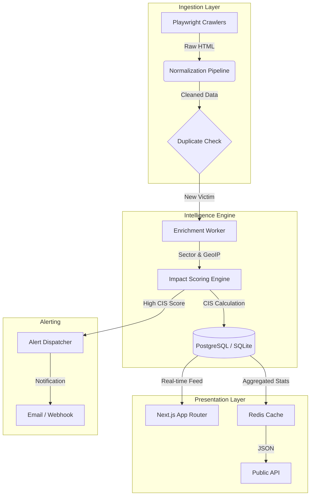

# RANSOMWATCH 🛡️

**Global Critical Infrastructure Ransomware Observatory**

[](https://github.com/AnandBinuArjun)
[](https://ransomwatch.org)
[](./LICENSE)


> **"Ransomware is no longer a corporate IT problem. It is a public safety threat."**

**RANSOMWATCH** is a real-time distributed cyber-threat observatory designed to monitor, ingest, and analyze ransomware attacks impacting critical infrastructure (Healthcare, Government, Energy, Education) worldwide.

Built as a SaaS-grade platform, it provides **Citizen Impact Scores (CIS)**, national cyber risk heatmaps, and early-warning alerts to NGOs, CERT teams, and journalists.

---

## �️ System Architecture

RANSOMWATCH follows a robust **Four-Tier Architecture**: `Collection` → `Normalization` → `Intelligence` → `Presentation`.



### � Ingestion Workflow

1. **Distributed Crawlers**: Isolated Node.js workers (managed by BullMQ) scrape dark web leak sites (LockBit, ALPHV, Cl0p).
2. **Normalization**: Raw data is cleaned, mapped to UN Critical Infrastructure sectors, and geolocated.
3. **Impact Scoring**: The **Citizen Impact Score (CIS)** is computed:
    $$ CIS = \frac{Sector \times \log_{10}(Pop) \times Sensitivity \times Recurrence}{TimeDecay} $$
4. **Distribution**: Data is pushed to the live dashboard and public API in real-time.

---

## 🚀 Key Features

### 📡 Real-Time Surveillance

- **Live Feed**: Monitors active ransomware groups 24/7.
- **Proof Archival**: Snapshots of leak data for evidence.
- **Multi-Group Support**: Track LockBit, ALPHV, Medusa, and more.

### 🧠 Intelligence & Analytics

- **Citizen Impact Score**: Quantifies the *human* cost of an attack, not just data size.
- **National Risk Index**: Dynamic heatmaps showing countries under cyber stress.
- **Sector Analysis**: Breakdown of attacks on Healthcare vs. Government/Finance.

### 🌐 Public Trust

- **Open API**: Full REST API (`/api/live`, `/api/map`) for researchers.
- **Open Datasets**: Monthly research-grade CSV exports.
- **Transparency**: Clear methodology and confidence scoring (`LOW` to `HIGH`).

---

## 🛠️ Technology Stack

| Component | Technology | Description |
| :--- | :--- | :--- |
| **Frontend** | **Next.js 15** | App Router, Server Components, Edge Runtime |
| **Styling** | **Tailwind CSS** | Glassmorphism, Responsive Grid, Framer Motion |
| **Backend** | **Node.js** | Server Actions, API Routes |
| **Database** | **Prisma (SQLite/PG)** | ORM, Type-safe Schema |
| **Queues** | **BullMQ + Redis** | Job scheduling for crawlers |
| **Maps** | **Mapbox GL** | Interactive WebGL Heatmaps |
| **Testing** | **Playwright** | E2E Testing & Scraping |

---

## 📂 Project Structure

```bash
/ransomwatch
 ├── /app
 │    ├── /api              # Public REST API Enpoints
 │    ├── /(public)         # Dashboard UI (Live, Map, Groups)
 │    ├── /engineering      # Architecture Documentation
 │    └── /transparency     # Methodologies
 ├── /components            # Reusable SaaS UI Components (GlassCard, etc.)
 ├── /lib
 │    ├── db.ts             # Prisma Client
 │    └── impactEngine.ts   # CIS Scoring Logic
 ├── /workers               # Crawler Definitions
 ├── /prisma
 │    ├── schema.prisma     # Database Models
 │    └── seed.ts           # Mock Data Generator
 └── /scripts               # Report Generation Utilities
```

---

## ⚡ Getting Started

### Prerequisites

- Node.js 18+
- npm

### Installation

1. **Clone the Repository**

    ```bash
    git clone https://github.com/AnandBinuArjun/RANSOMWATCH.git
    cd RANSOMWATCH
    ```

2. **Install Dependencies**

    ```bash
    npm install
    ```

3. **Setup Environment**
    Create a `.env` file (or use existing):

    ```env
    DATABASE_URL="file:./dev.db"
    NEXT_PUBLIC_MAPBOX_TOKEN="pk.your_token_here"
    ```

4. **Initialize Database**

    ```bash
    npx prisma db push
    npx tsx prisma/seed.ts  # Loads sample threat data
    ```

5. **Run Development Server**

    ```bash
    npm run dev
    ```

    OPEN: [http://localhost:3000](http://localhost:3000)

---

## � API Documentation

| Endpoint | Method | Description |
| :--- | :--- | :--- |
| `/api/live` | `GET` | Return latest 50 verified incidents |
| `/api/map` | `GET` | Get National Risk Index for all countries |
| `/api/groups` | `GET` | List active ransomware groups and stats |
| `/api/country/[iso2]` | `GET` | Specific country threat profile |

---

## 🛡️ License

This project is licensed under the **MIT License**.

**Operated & Maintained by [Anand Binu Arjun](https://anandbinuarjun.live).**

*Use this software responsibly. This platform is intended for defensive cyber-intelligence, research, and public safety monitoring.*
